# Welcome to your hotel booking mobile app in Bahir Dar 👋

## Get Started

Install dependencies

```bash
npm install
```

Start the app

```bash
npx expo start
```

## Welcome Screen

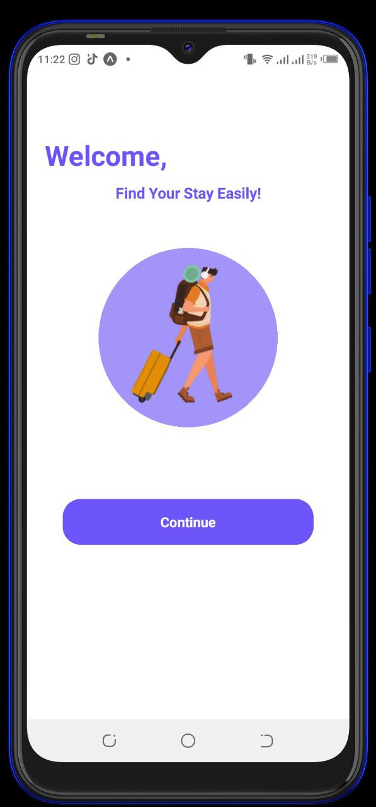

## Get Started Screen

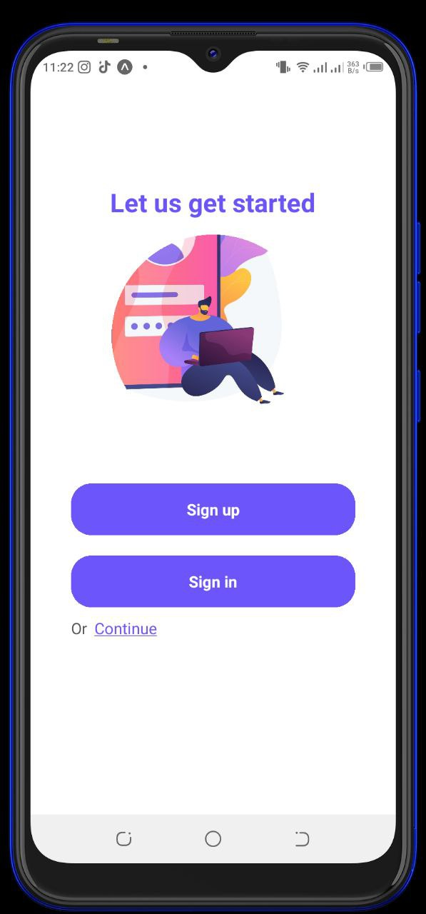

## Sign Up Screen

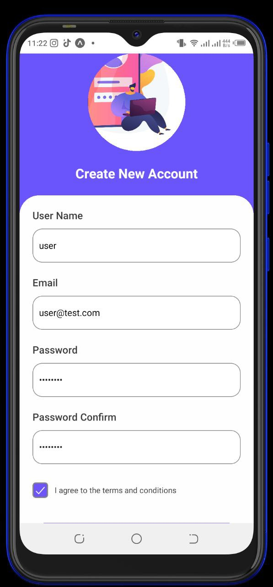  
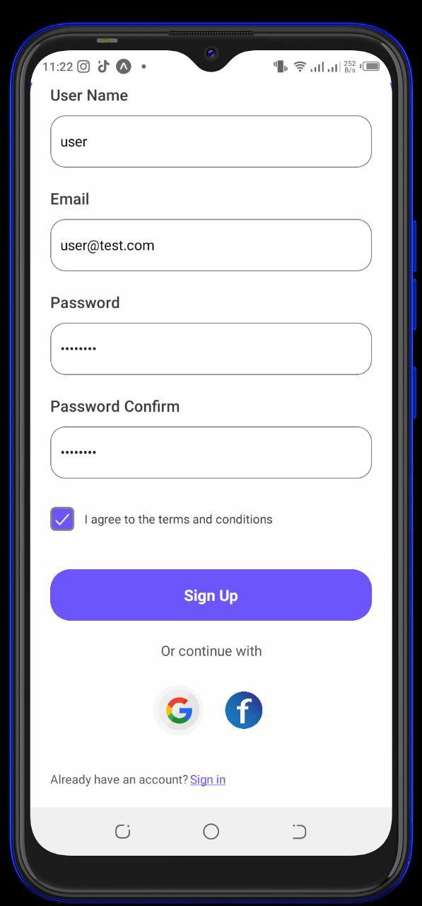

## Sign In Screen

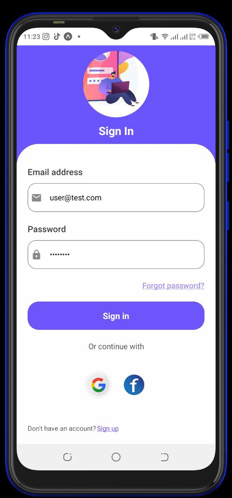

## Forgot Password Screen

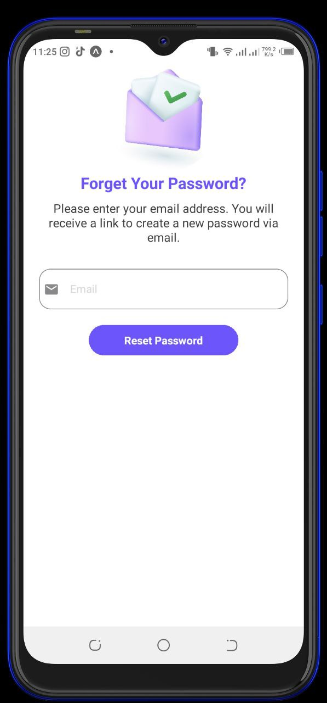

## Home Tab

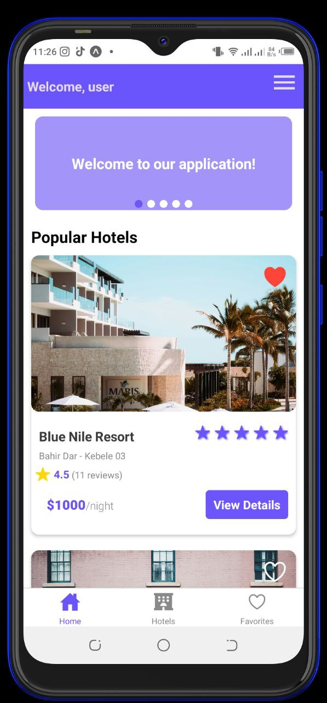  
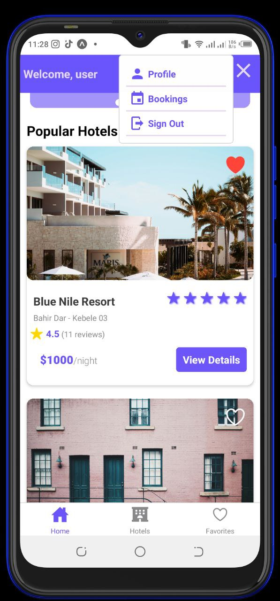

## Hotels Tab

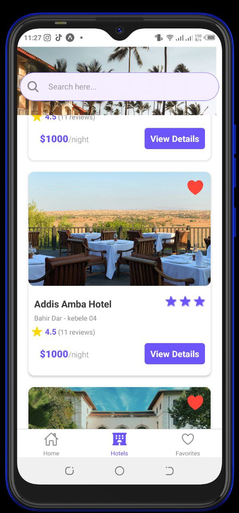

## Hotel Details

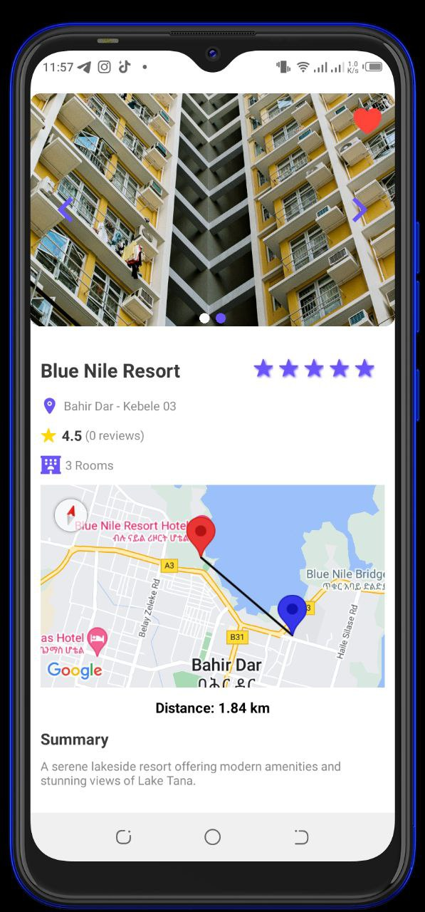  
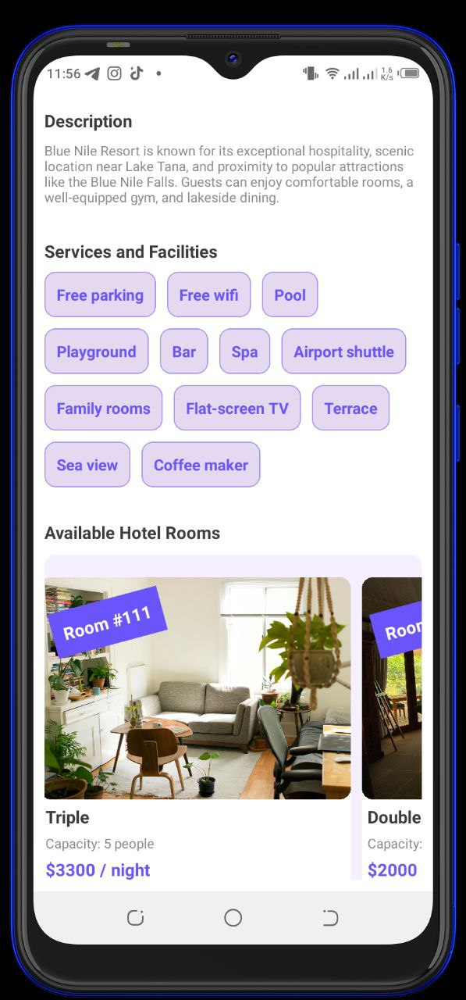  
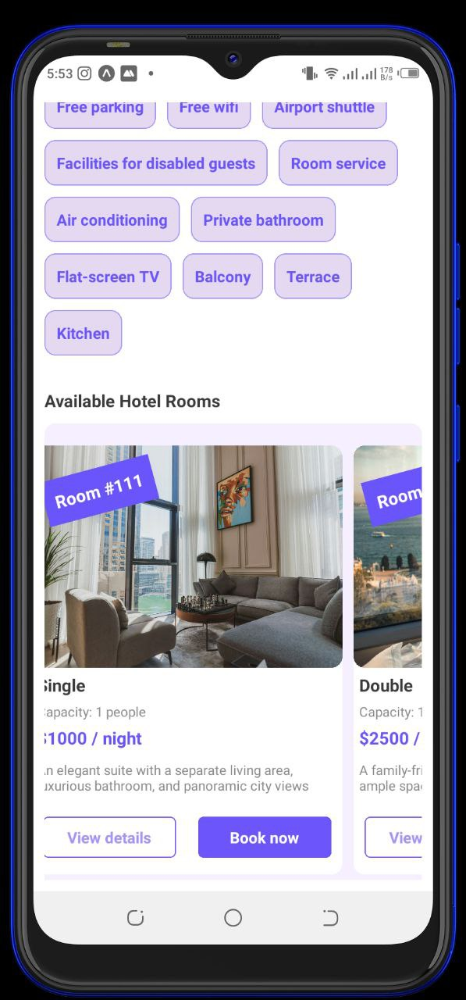

## Favorites Tab

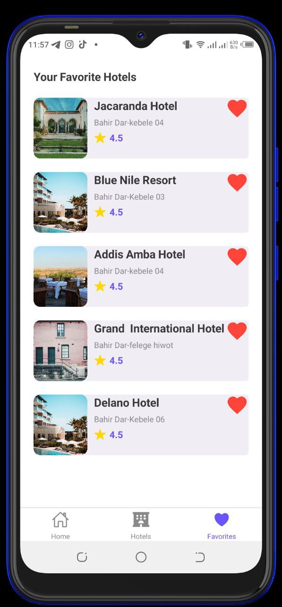

## Profile information

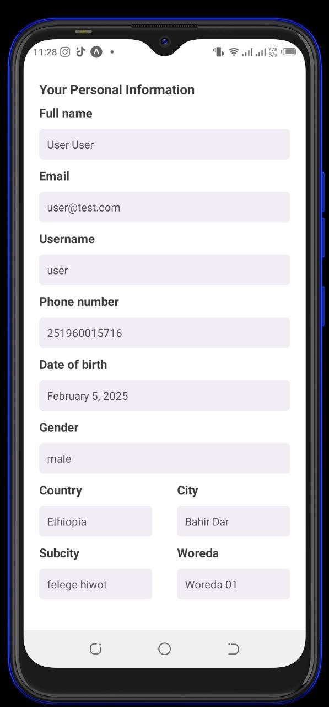

## Bookings

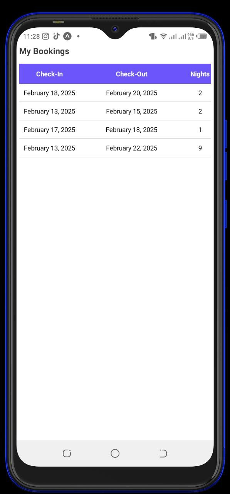
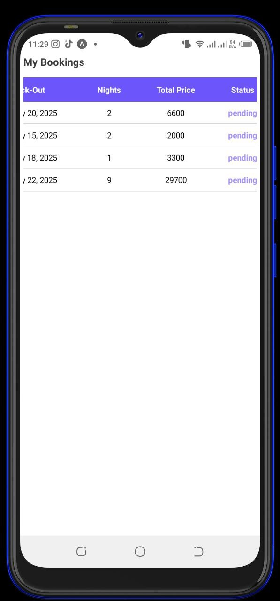
